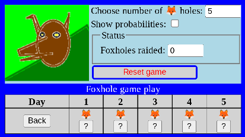
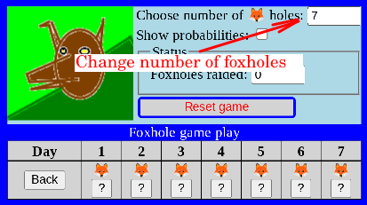
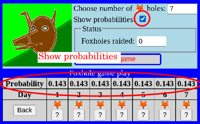
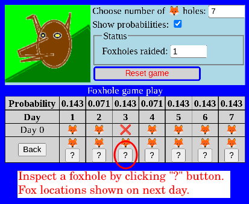

# Foxholes

## Quick link:
[Foxholes](https://alfille.github.io/foxholes.github.io/)

## Summary

This program is a way to test strategies.

## Screenshots

Initial screen showing game controls and start of standard (5 hole) game.

You can change the number of foxholes to add interest.

Choosing probabilities adds the chance that a randomly placed and moving fox is in this hole (after you tried to catch them).

You actually play the game by choosing to inspect a hole (one of the "?" buttons).
The next row shows where the uncaught foxes could move to.

## Platform

Pure *Javascript* in any browser.

## Author

Paul Alfille paul.alfille@gmail.com

## License

MIT (free for any use)
