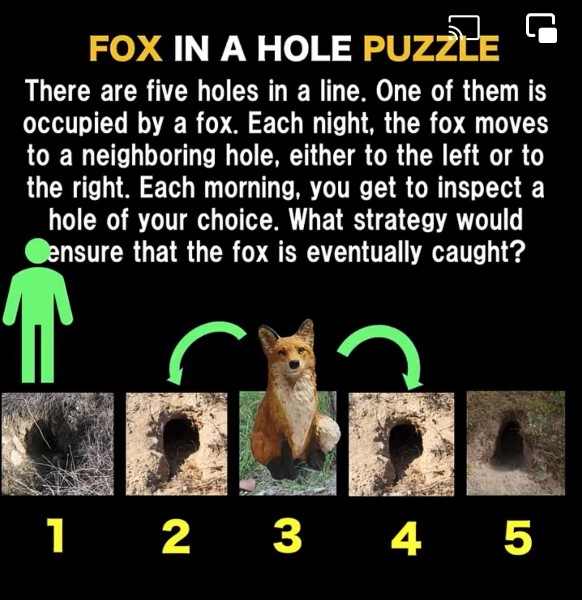

# Foxholes

## Summary

This program is a way to test strategies.

There are two versions:

1. __Take turns__ Fox moves after inspection (i.e. you look in the morning, and the fox moves overnight)
2. __Simultaneous__ Fox moves while you go to another hole (so can sneak past you)

## Platform

Pure *Javascript* in any browser.

## Author

Paul Alfille paul.alfille@gmail.com

## License

MIT (free for any use)